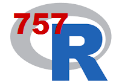

  

757 R User Group: <a href="http://www.meetup.com/757-R-Users-Group/" target="_blank">http://www.meetup.com/757-R-Users-Group/</a>

757 R Users Group
========================================
author: Regular Meeting
date: October 18, 2016
css: ../757-rug-presentations.css

WiFi
========================================

 
Getting on Library WiFi:  
 
<u>Network Key</u>: nplwireless (first time only)  
<u>Username</u>: nplguest  
<u>Password</u>: nplguest  
 

Upcoming Norfolk Data Science Meeting
========================================

 

 
<ul>
  <li>Presentation: Outline and Practice with Git and GitHub</li>
  <li>Food & Sponsors: Dominion Enterprises</li>
  <li>When: Tuesday, November 1st, 2016 @ 6:30 PM</li>
  <li>Where: Slover Library 105 Board Room</li>
</ul>

Next 757 RUG Meeting
========================================

&nbsp;&nbsp;Image from: <a href="http://spf13.com/post/soap-vs-rest">http://spf13.com/post/soap-vs-rest</a>

 

  <ul>
    <li>Presentation: Working with APIs from R</li>
    <li>When: Tuesday, November 15th, 2016 @ 6:30 PM</li>
    <li>Where: Slover Library 105 Board Room</li>
  </ul>
  

Dominion Enterprises Open Data Hackathon
========================================

 
<ul>
  <li>What: Teams of 4 or 5 compete to do something cool with data.</li>
  <li>Focus: Community Data - United Way of Southampton is providing data</li>
  <li>When: December 2nd and 3rd, 2016 (Friday & Saturday)</li>
  <li>Where: 150 Granby St, Norfolk (downtown, DE building)</li>
</ul>

